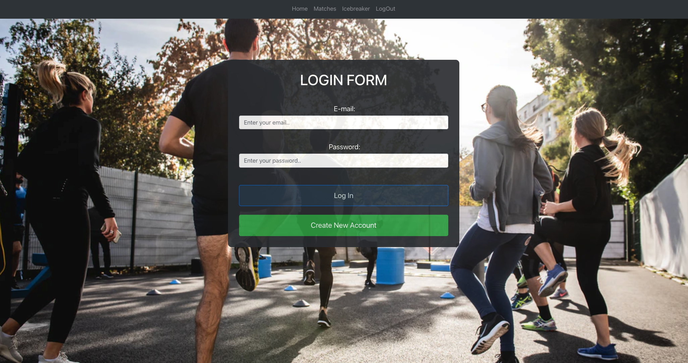

# MuscleMates

## About The Project
```
This project is an application used to find gym goers in a specific area. Users can create a profile by entering their first and last names, eamil, username, and password. After users are logged in, they are presented with their profile page. Their profile page contains a picture, bio, activities, name, age, phone number. email, and location. After a profile is created, users can then find their matches within a 5-mile radius of their area. 
```
## Technologies:
- NPM Zip Code

- Express

- Node.js 

- Jquery

- Sequelize

- Serverside API

- MySQL


## Project Requirements:
```

You and your group will use everything you’ve learned over the past six units to create a real-world full-stack application that you’ll be able to showcase to potential employers. The user story and acceptance criteria will depend on the project that you create, but your project must fulfil the following requirements:

* Use Node.js and Express.js to create a RESTful API.

* Use Handlebars.js as the template engine.

* Use MySQL and the Sequelize ORM for the database.

* Have both GET and POST routes for retrieving and adding new data.

* Use at least one new library, package, or technology that we haven’t discussed.

* Have a folder structure that meets the MVC paradigm.

* Include authentication (express-session and cookies).

* Protect API keys and sensitive information with environment variables.

* Be deployed using Heroku (with data).

* Have a polished UI.

* Be responsive.

* Be interactive (i.e., accept and respond to user input).

* Meet good-quality coding standards (file structure, naming conventions, follows best practices for class/id naming conventions, indentation, quality comments, etc.).

* Have a professional README (with unique name, description, technologies used, screenshot, and link to deployed application).
```


Deployed Application: 
[HerokuMuscleMates](https://github.com/crsmith01/Musical)

## screenshot


## Brought To You by:

* [Stephen Yacas](https://github.com/wilks625)
* [Randy Faison](https://github.com/randyfasion)
* [Alexander Vandenesse ](https://github.com/vandenessea)
* [Carlos Monge](https://github.com/Cmonge135)
